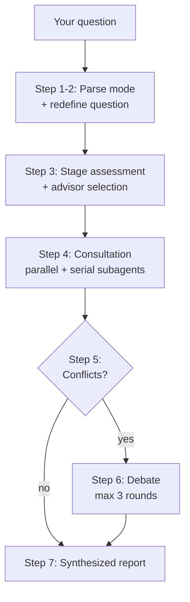

# Qadvisor — Your AI Advisory Board

> 17 legendary minds. One boardroom. They don't just answer — **they argue**.

**English** | [中文](README.zh-CN.md)

[](LICENSE)
[](CONTRIBUTING.md)
[](#install)

Ask a hard question — *"A competitor cut prices by 50%. Should I match?"* — and Qadvisor:

1. **Redefines** your question (what you asked vs. what actually needs solving)
2. **Routes** it to the 3–5 most relevant advisors from a 17-master board
3. Runs them **in parallel** as independent subagents, each locked into their own framework
4. **Detects conflicts** between their verdicts
5. Forces up to **3 rounds of debate** until they converge — or declares the disagreement irreconcilable
6. Hands you a **synthesized report** with explicit ✅ / ⚠️ / ❌ verdicts and next steps

## Why this isn't just 17 prompts

Most "persona prompt" collections give you 17 monologues. Qadvisor is built as a decision system:

- **A dispatcher, not a picker.** It reframes your question first — "how do I raise conversion?" often becomes "who exactly is your target customer?"
- **Dependency-aware execution.** Drucker (is it worth doing?) runs *before* Karpathy (can AI do it?). Independent advisors run in parallel.
- **Conflict detection + forced debate.** When Munger says ❌ and Musk says ✅, they get each other's arguments and must respond — revise, rebut, or synthesize. Hard cap: 3 rounds.
- **Brake mechanisms.** Every advisor has an explicit list of decisions they exist to *kill* — Munger hunts sunk-cost traps, Buffett rejects moat-diluting opportunities, Sun Tzu vetoes fights you can't win.
- **Output discipline.** Every analysis is capped at 600 words and must contain at least 3 specific numbers. No consultant waffle.
- **Eval-tested.** Advisors are tuned against test suites with binary pass/fail criteria ([evals/](evals/)) — the Munger skill went from 72% → 100% pass rate through systematic prompt optimization.

## Install

### As a Claude Code plugin (recommended)

```bash
claude
```

Then inside Claude Code:

```
/plugin marketplace add wolfqing/QadvisorSkills
/plugin install qadvisor@qadvisor
```

### Manual install

```bash
git clone https://github.com/wolfqing/QadvisorSkills.git
cp -r QadvisorSkills/skills/* ~/.claude/skills/
```

## Usage

```
/qadvisor Should I quit my job to work full-time on my side project?
```

```
/qadvisor --deep We're a 3-person team building an AI note-taking app. Big Tech just shipped the same feature for free. What now?
```

| Mode | Command | Advisors |
|------|---------|----------|
| Standard | `/qadvisor [question]` | 3–5, auto-routed |
| Deep | `/qadvisor --deep [question]` | 8–10, all relevant layers |
| Full board | `/qadvisor --all [question]` | All 17 |
| Single advisor | `/qadvisor-munger [question]` | Just that advisor |

Advisors **respond in your language** — ask in English, get English; 中文提问，中文回答.

## Example report (condensed)

```
📋 Board Report: Should we match the competitor's 50% price cut?

⚡ Question redefinition:
  You asked: "Should we match their price?"
  The core question is actually: "Is your moat pricing — or something they can't cut?"

📍 Stage assessment: Competition

👥 Advisors consulted (4): buffett, helmer → sunzi (power diagnosis before game strategy), munger

| Advisor | Dimension | Verdict | Core position |
|---------|-----------|---------|---------------|
| Buffett | Moat & focus | ❌ | Matching converts a moat war into a margin war you both lose |
| Helmer  | 7 Powers    | ⚠️ | You have switching costs; price is their only weapon — starve it |
| Sun Tzu | Strategy    | ❌ | 避实击虚 — never fight on the terrain they chose |
| Munger  | Multi-model | ❌ | Inversion: matching guarantees -40% margin; churn risk is only ~8% |

🤝 Consensus: Don't match. Deepen switching costs; let them bleed capital.
⚔️ Conflicts: none — no debate needed.

➡️ Recommended next steps:
  1. Quantify actual churn attributable to price (target: know within 2 weeks)
  2. Ship the integration that raises switching costs (owner: product, 30 days)
  3. Revisit only if churn exceeds 15%/quarter
```

## The board

| Layer | Advisor | What they're for |
|-------|---------|------------------|
| **Strategy** | Peter Drucker | What is the customer actually paying for? |
| | Charlie Munger | Multi-disciplinary stress-testing; bias hunting |
| | Warren Buffett | Moats, focus, saying no |
| **Competition** | Hamilton Helmer | 7 Powers — diagnose your structural advantage |
| | Clay Christensen | Disruption paths, jobs-to-be-done |
| | Sun Tzu | Fight or avoid; asymmetric strategy |
| **Product & Experience** | Steve Jobs | Insanely-great bar; what to cut |
| | Kenya Hara | Essence, clarity, emptiness |
| | Nir Eyal | Hook model, habit design |
| | Daniel Kahneman | System 1/2, biases, choice architecture |
| | Andrej Karpathy | What AI can/can't do; AI product architecture |
| **Growth & Distribution** | Andrew Chen | Cold start, network effects, flywheels |
| | Seth Godin | Purple Cow — is this worth talking about? |
| | Donald Miller | StoryBrand — clarify the message |
| | George Lois | The Big Idea that cuts through noise |
| **Execution & Startup** | Elon Musk | First principles, timeline compression |
| | Paul Graham | Idea quality, PMF, do things that don't scale |

Every advisor is built on the same three-part spine:

1. **A question framework** — how this mind actually interrogates a problem
2. **A decision domain** — what to bring them, what to route elsewhere
3. **A brake mechanism** — the decisions they exist to kill

## How it works



## Evals

Persona prompts are easy to write and hard to make *good*. Each advisor is meant to be tuned
against a test suite: 5 hard questions × 5 binary criteria (conciseness, genuine framework
application, quantitative reasoning, voice, assumption-challenging).

The Munger advisor has completed this loop — baseline 72% → 100% after adding output caps and
quantification requirements. See [evals/munger/](evals/munger/) for the full changelog and
results. Eval suites for the other 16 advisors are open work — [contributions welcome](CONTRIBUTING.md).

## Add your own advisor

The board is designed to grow. Want Nate Silver for data decisions? Edward Tufte for
information design? Your favorite domain thinker?

Read [CONTRIBUTING.md](CONTRIBUTING.md) and start from the
[advisor template](docs/ADVISOR_TEMPLATE.md). PRs that include an eval run get merged faster.

## Disclaimer

These skills are **educational interpretations** of publicly documented thinking frameworks —
books, essays, interviews, and lectures. They are not affiliated with, endorsed by, or
representative of the real individuals or their estates. Outputs are AI-generated analysis for
brainstorming and education, **not professional, legal, financial, or investment advice**.
See [DISCLAIMER.md](DISCLAIMER.md).

## License

[MIT](LICENSE)
