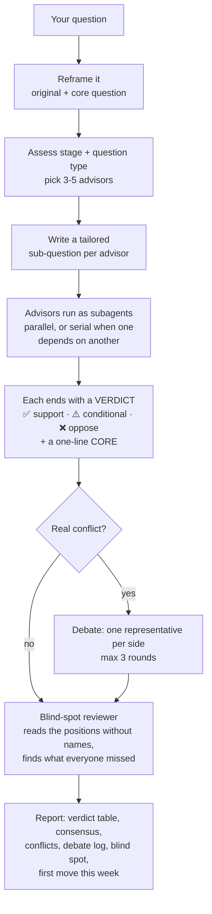

<div align="center">


**English** | [中文](README.zh-CN.md)

[](LICENSE)
[](https://github.com/wolfqing/QadvisorSkills/actions/workflows/ci.yml)
[](#claude-code)
[](https://agentskills.io)
<!-- EVAL-BADGE -->

</div>

# Qadvisor: an AI advisory board for hard decisions

Ask one AI a hard question and you get one confident answer. Qadvisor puts the question in
front of a board of 17 advisors modeled on the documented thinking of Charlie Munger, Warren
Buffett, Steve Jobs, Paul Graham and 13 others. It rewrites your question into the one that
actually needs answering, picks the 3-5 advisors whose frameworks fit, has each answer on its
own, makes them argue when they genuinely disagree, and asks a reviewer, who sees the answers
without names, what all of them missed. You get a one-page verdict and a first move for this
week. The disagreement is the point: that's where the risk in a decision hides.

For founders, PMs, operators, investors and builders. It runs in Claude Code, claude.ai, Claude
Cowork and other coding agents, and it answers in your language.

## Try saying

```text
board this: a competitor just cut prices 50%. We're at $40k MRR with 70% gross margin. Do we match?
```

```text
What would Munger say about quitting my $140k job for a side project at $2k MRR?
```

```text
Pit Munger against Musk: ship the beta next week, or spend another month on reliability?
```

```text
顾问团帮我看看：我们要不要放弃国内市场，全力做海外？
```

```text
/qadvisor --deep We're a 3-person team building an AI note-taking app. Big Tech just shipped the same feature for free. What now?
```

It works best on a decision with a real tradeoff and your actual numbers. It stays out of the
way for coding tasks and factual lookups.

## Example

<!-- EXAMPLE-REPORT -->

## Install

Pick the place where you already use Claude. Each route installs the whole board.

- **Claude in the browser or the desktop app?** → [claude.ai and Claude Cowork](#claudeai-and-claude-cowork)
- **Claude Code?** → [Claude Code](#claude-code)
- **Another agent (Codex, Cursor, OpenCode…)?** → [npx skills](#any-agent-via-npx-skills)

**Check it worked:** after installing, ask `What would Munger say about learning piano before
guitar?` Munger should answer in his own voice.

### Claude Code

Inside Claude Code, run:

```text
/plugin marketplace add wolfqing/QadvisorSkills
```

```text
/plugin install qadvisor@qadvisor
```

**Rather not type commands?** Paste this into Claude Code and it installs itself:

```text
Install the Qadvisor plugin for me. Run `claude plugin marketplace add wolfqing/QadvisorSkills`, then `claude plugin install qadvisor@qadvisor`. When both succeed, tell me to type /reload-plugins.
```

Then ask with `/qadvisor your question`, or just say "board this". If another command already
uses that name, the full name is `/qadvisor:qadvisor`.

### claude.ai and Claude Cowork

- **Paid plans (Pro, Max, Team, Enterprise; this route is not yet tested end-to-end):** go to
  **Customize > Plugins > Add > Add marketplace**, enter `wolfqing/QadvisorSkills`, then add
  the **qadvisor** plugin. Plugin skills sync to chat, Cowork and Claude Code.
- **Any plan with code execution:** download
  [`qadvisor-skill.zip`](https://github.com/wolfqing/QadvisorSkills/releases/latest/download/qadvisor-skill.zip)
  and upload it at **Customize > Skills > + > Create skill > Upload a skill**, then switch it
  on. It needs **Settings > Capabilities > Code execution and file creation** turned on (on
  Team and Enterprise, an owner enables Skills and code execution first).

Plain claude.ai chat can't run subagents, so the board runs in
[single-context mode](#faq) there. Cowork runs subagents.

### Any agent via npx skills

Codex, Cursor, OpenCode, Claude Code and more, through the open [`skills`](https://github.com/vercel-labs/skills) CLI (Node 22.20+).

Into Claude Code (`-a` picks the agent):

```bash
npx skills add wolfqing/QadvisorSkills --skill '*' -a claude-code -g -y
```

Into every agent it detects, with no prompts:

```bash
npx skills add wolfqing/QadvisorSkills --all
```

<details>
<summary>More options</summary>

```bash
npx skills add wolfqing/QadvisorSkills --list                              # see what's in the repo
npx skills add wolfqing/QadvisorSkills --skill qadvisor -a claude-code -g -y  # dispatcher only: it already carries all 17 frameworks
```

The `skills` CLI sends anonymous telemetry; set `DISABLE_TELEMETRY=1` to turn it off. Subagent
support varies by agent; where there are none, the board runs in single-context mode.

</details>

### Manual

```bash
git clone https://github.com/wolfqing/QadvisorSkills.git
mkdir -p ~/.claude/skills
cp -r QadvisorSkills/skills/* ~/.claude/skills/
```

For a single project, copy into that project's `.claude/skills/` instead. If the skills folder
did not exist before, restart Claude Code once.

## Usage

| Mode | How to ask | What happens | Advisors |
|---|---|---|---|
| **Standard** | "board this: …", "ask the board…", "顾问团…", or `/qadvisor …` | Reframe, route, consult, debate real conflicts, blind-spot check, report | 3-5, auto-routed |
| **Deep** | `/qadvisor --deep …` | Same pipeline, covering every relevant layer | 8-10 |
| **Full board** | `/qadvisor --all …` | Everyone answers in parallel. Token-heavy | 17 |
| **One advisor** | "What would Munger say about…", "芒格怎么看…", or `/qadvisor-munger …`¹ | That advisor answers directly in their own voice. No report | 1 |
| **Named panel** | "Munger and Buffett on this: …" | The full pipeline with exactly the advisors you name | 2+ |
| **Debate** | "Pit Munger against Musk on…" or `/qadvisor --debate munger musk …` | A panel of two with at least one forced debate round, even if they agree | 2 |

¹ Where the advisor skills are installed (Claude Code plugin, npx skills, manual); in a plugin,
`/qadvisor:qadvisor-munger` if another command shadows it. With the claude.ai zip, ask in words.

Ask in English, get English. 中文提问，中文回答. The same goes for other languages.

## The board

Every advisor has the same spine: a **question framework** (how this mind interrogates a
problem), a **decision domain** (what to bring them) and a **brake**, the kind of decision it
exists to kill.

| Layer | Advisor | Brings | Kills |
|---|---|---|---|
| **Strategy** | Peter Drucker | Who the customer is and what they actually pay for | Ideas nobody can name a customer for |
| | Charlie Munger | Inversion, mental models, bias hunting | Sunk-cost traps and untested downside |
| | Warren Buffett | Moats, focus, the 20-slot punch card | Diversifying before the core is defensible |
| **Competition** | Hamilton Helmer | 7 Powers: which structural advantage you really have | Imaginary moats ("our team is great") |
| | Clay Christensen | Disruption paths, jobs-to-be-done | Head-on fights with a stronger incumbent |
| | Sun Tzu | Whether to fight, where, and how | Frontal assaults and reacting to every move |
| **Product & Experience** | Steve Jobs | The insanely-great bar; what to cut | Feature bloat and "good enough" |
| | Kenya Hara | Essence, emptiness, clarity | Complexity creep dressed up as richness |
| | Nir Eyal | Hook model, habit design | Engagement without real user value |
| | Daniel Kahneman | System 1 and 2, framing, choice architecture | Designing for perfectly rational users |
| | Andrej Karpathy | What AI can and can't do; AI architecture and costs | AI for AI's sake |
| **Growth & Distribution** | Andrew Chen | Cold start, network effects, growth loops | Vanity metrics and paid-only growth |
| | Seth Godin | Purple Cow, the smallest viable audience | "Let's target everyone" |
| | Donald Miller | StoryBrand: a clear message, customer as hero | Clever copy over clear copy |
| | George Lois | The Big Idea that cuts through | Safe creative nobody notices |
| **Execution & Startup** | Elon Musk | First principles, timeline compression | Perfectionism posing as diligence |
| | Paul Graham | Idea quality, PMF, things that don't scale | Building without talking to users |

Each framework lives in its own file: [`skills/qadvisor-munger/SKILL.md`](skills/qadvisor-munger/SKILL.md), and so on.

## How it works



- **A pure dispatcher.** It routes, moderates and writes the report, and never softens or
  overrides a verdict. If every advisor says no, the report says no.
- **Debate only on real conflicts.** Every advisor ends with ✅, ⚠️ or ❌ on the same
  one-sentence proposition, so conflicts are read off those lines, not guessed from tone. A ✅
  facing a ❌ triggers a debate between one representative per side, at most 3 rounds. When
  advisors agree, no debate rounds run.
- **A blind-spot reviewer on every board run.** It sees each advisor's verdict and a short
  summary with the names removed, and looks for what nobody raised. It runs even when everyone
  agrees, because consensus is where groupthink hides.

<details>
<summary>More design choices</summary>

- **Output caps.** Each advisor gets at most 600 words (about 1,000 CJK characters) and must
  use at least 3 specific numbers, with estimates labeled as estimates. No consultant waffle.
- **Dependencies are respected.** Drucker (is it worth doing?) runs before Karpathy (can AI do
  it?); Helmer (what power do you have?) runs before Sun Tzu (how do you fight?).
- **Debates stop early.** A debate ends on convergence, or, when arguments start repeating,
  is recorded as an irreconcilable disagreement instead of being papered over. Contradictory
  actions count as a conflict too, not only ✅ against ❌.

</details>

## Qadvisor vs LLM Council

The other popular board-style skill is
[aiwithremy/claude-skills-llm-council](https://github.com/aiwithremy/claude-skills-llm-council)
(credited to Ole Lehmann), with a variant by tenfoldmarc. Both adapt Andrej Karpathy's
[LLM Council](https://github.com/karpathy/llm-council) idea, which is a good one. Karpathy's
original asks several different LLMs; both skills, like Qadvisor, run one model behind
different prompts. They make different design bets:

| | LLM Council | Qadvisor |
|---|---|---|
| **Advisor roster** | 5 fixed thinking-style lenses (Contrarian, First Principles Thinker, Expansionist, Outsider, Executor), about one paragraph each; explicitly not personas | 17 named advisors in 5 layers, each with a documented framework in its own SKILL.md |
| **Who answers** | All 5 lenses on every council question; a trigger gate skips trivial or factual questions | 3-5 routed by stage and question type; 8-10 with `--deep`, all 17 with `--all`; single advisor or named panel also available |
| **How advisors engage** | One anonymous peer-review round (randomized A-E labels): strongest response, biggest blind spot, collective miss; runs every time | Named pairwise debate (up to 3 rounds) only on real conflicts, plus an anonymized blind-spot reviewer on every board run |
| **Footprint, evals, license** | One SKILL.md (~2.5-2.7K words); no evals; no license file (aiwithremy) / MIT in README (tenfoldmarc) | Dispatcher + 17 advisors; native eval suite with no-plugin ablation; MIT LICENSE |

<details>
<summary>Full comparison</summary>

| | LLM Council | Qadvisor |
|---|---|---|
| **Question prep** | Scans the workspace (CLAUDE.md, memory/, earlier transcripts), then frames one neutral prompt for all advisors; asks 1 clarifying question if vague | Redefines the question (original and core question both shown), assesses stage, skims up to 3 referenced project files, writes a tailored sub-question per advisor |
| **Execution** | Fixed 3 phases: 5 advisors in parallel, then 5 reviewers in parallel, then 1 chairman (11 subagents) | Parallel groups plus serial chains where one advisor depends on another; subagent count varies with mode and debates |
| **Final synthesis** | Chairman verdict: agrees / clashes / blind spots / recommendation / one first step; may side with a lone dissenter | Neutral dispatcher report: reframing, stage, verdict table, consensus, conflicts, debate log, blind spot, first move + follow-ups |
| **Output limits** | 150-300 words per advisor, reviews under 200 words | ≤600 words and ≥3 specific numbers per advisor; one-line core position |
| **Language & platforms** | English; Claude Code and Cowork (aiwithremy), or HTML report + transcript in Claude Code (tenfoldmarc) | Follows the user's language (EN/中文/…); Claude Code plugin, claude.ai/Cowork plugin or zip, other agents via npx skills |

</details>

**Pick LLM Council** if you want one file you can read in a single sitting, lenses that don't
borrow real people's names, a fixed contrarian and outsider seat on every question, and a
chairman who commits to a single call. **Pick Qadvisor** if you want named, documented
frameworks routed to the question, debates only where advisors truly clash, and an eval suite
that compares it with plain Claude, which you can rerun yourself.

## Evals

The suite asks one question: **does installing Qadvisor beat asking Claude to "think like
Munger"?** It uses the `claude plugin eval` runner built into recent Claude Code (CI pins
2.1.288). Every case runs twice, with the plugin and without it, and the difference (Δ) is
what the plugin adds.

- **5 Munger cases** (quitting a job, a price war, a term sheet, a market pivot, a big
  client), each graded on concision, framework depth, self-derived numbers, a committed
  verdict and challenged assumptions
- **3 board cases**: a standard board run in English, one in Chinese, and a forced
  Munger-vs-Musk debate
- **1 must-not-trigger case**: an ordinary coding request must not summon the board

Graders are short files in `evals/*/*/graders/`: plain-language rubrics scored by an LLM judge
(Sonnet when pinned as below), plus regex checks such as a word limit and tool checks such as
"at least 3 advisor subagents". Read them before trusting any number.

Reproduce it from the repo root (it calls models on your account, and the board cases launch
many subagents):

```bash
claude plugin eval . --trust-plugin --model sonnet --judge-model sonnet -j 4
```

<!-- EVAL-TABLE -->

Case details and cheaper subsets: [evals/README.md](evals/README.md). An earlier hand-run loop
took the Munger advisor from 72% to 100% (18/25 to 25/25) on its own five criteria; the log
is in [evals/history/](evals/history/).

## Cost and speed

<!-- COST-TABLE -->

`--all` consults all 17 advisors and is token-heavy; save it for the decisions that deserve it.

## FAQ

<details>
<summary><b>Is this really Munger?</b></summary>

No. Each advisor is an educational interpretation of the thinking framework a person
documented in public books, essays, letters and talks. None of them is affiliated with or
endorsed by the real person, their companies or their estate. See [DISCLAIMER.md](DISCLAIMER.md).

</details>

<details>
<summary><b>Aren't they all the same model?</b></summary>

Yes. Every advisor runs on whatever model your agent uses. The diversity comes from 17 written
frameworks, separate subagent contexts, a tailored sub-question for each advisor and a forced
verdict on one shared proposition, not from different models. Karpathy's original LLM Council
compares different LLMs; this is the single-model, framework-driven take on the idea.

</details>

<details>
<summary><b>Why not just ask Claude to think like Munger?</b></summary>

That is exactly what the evals are built to measure: the "without" arm is plain Claude asked
to channel the advisor, and Δ is what Qadvisor adds on top. Run them yourself (see
[Evals](#evals)). On a board run, a single prompt also can't give you what the structure does:
independent answers, verdicts on one shared proposition, debates between real opponents and a
blind-spot check that doesn't see names.

</details>

<details>
<summary><b>Does it work in Chinese?</b></summary>

Yes. It replies in the language you write in, 中文 included. "顾问团" and "让顾问们看看" trigger
the board, "芒格怎么看…" reaches one advisor, and one eval case runs a standard board in Chinese.
There is also a [Chinese README](README.zh-CN.md).

</details>

<details>
<summary><b>Does it work without subagents?</b></summary>

Yes. Where subagents aren't available, such as plain claude.ai chat, the board runs in
single-context mode: one model writes each advisor's answer in its own block as if it hadn't
seen the others, then runs a shorter debate and the same report. The answers are less
independent than true subagents, and the report footer says when this mode was used.

</details>

<details>
<summary><b>Why can't Claude call the advisors on its own?</b></summary>

Claude Code lists every auto-invocable skill's description in a budget of about 1% of the
context window and starts dropping descriptions when it overflows. Seventeen advisors would
crowd out your other skills and compete for the same triggers. So only the dispatcher's
~900-character description sits in Claude's context, and the advisors are user-invoked. You
lose nothing: say "what would Munger say…" and the dispatcher brings Munger in.

</details>

<details>
<summary><b>Is my data sent anywhere?</b></summary>

Not by Qadvisor. It is a set of prompt files that run inside your own agent. Your question goes
only where your agent already sends it (for Claude, to Anthropic), with no extra servers,
accounts or tracking. The one exception is the third-party `npx skills` installer, which sends
anonymous install telemetry unless you set `DISABLE_TELEMETRY=1`.

</details>

<details>
<summary><b>Can I add my own advisor?</b></summary>

Yes. See the next section.

</details>

## Add your own advisor

Known gaps include data-driven decisions (Nate Silver) and information design (Edward
Tufte). Start from the [advisor template](docs/ADVISOR_TEMPLATE.md)
and follow [CONTRIBUTING.md](CONTRIBUTING.md): a new advisor needs a documented framework, a
brake, real disagreement with someone already on the board, and an eval run that shows its Δ.
The original design log (in Chinese) is in [docs/design-log.zh-CN.md](docs/design-log.zh-CN.md).

## Disclaimer

The advisors are educational interpretations of publicly documented frameworks. They are not
the real people and are not affiliated with or endorsed by them, their companies or their
estates. Outputs are AI-generated analysis for brainstorming, **not professional, legal,
medical, financial or investment advice**; nothing from the Buffett or Munger advisors is a
recommendation to buy or sell a security. Takedown requests are handled promptly. Full text:
[DISCLAIMER.md](DISCLAIMER.md).

## License

[MIT](LICENSE)

---

<div align="center">

If the board saved you from one bad decision, a ⭐ helps others find it.

</div>
