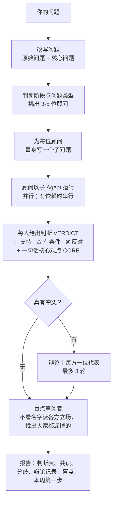

<div align="center">


[English](README.md) | **中文**

[](LICENSE)
[](https://github.com/wolfqing/QadvisorSkills/actions/workflows/ci.yml)
[](#claude-code)
[](https://agentskills.io)
<!-- EVAL-BADGE -->

</div>

# Qadvisor：为艰难决策准备的 AI 顾问团

把一个难题丢给一个 AI，你得到的是一个笃定的答案。Qadvisor 把问题交给一个 17 人的顾问团，
每位顾问都依据真人公开留下的思考方式建模：查理·芒格、沃伦·巴菲特、史蒂夫·乔布斯、保罗·格雷厄姆，
还有另外 13 位。它会先把你的问题改写成真正需要回答的那个问题，挑出框架最对口的 3-5 位顾问，
让他们各自独立作答；意见真有分歧时让他们当面辩论，最后请一位审阅者在看不到名字的情况下，
指出所有人都漏掉的东西。你拿到的是一页结论，外加这周就能动手的第一步。分歧才是重点：
决策里的风险，往往就藏在那里。

写给创业者、产品经理、运营负责人、投资人和开发者。可以在 Claude Code、claude.ai、Claude Cowork
和其他编程 Agent 里使用，你用什么语言问，它就用什么语言答。

## 试试这样问

```text
顾问团帮我看看：我们要不要放弃国内市场，全力做海外？
```

```text
让顾问们看看：竞争对手刚把价格砍了一半。我们月收入 30 万，毛利率 70%，跟不跟？
```

```text
芒格怎么看：年薪 100 万，要不要辞职去全职做一个月收入 1.5 万的副业？
```

```text
芒格 vs 马斯克：下周就发 beta，还是再花一个月把稳定性做扎实？
```

```text
/qadvisor --deep 我们是 3 人团队，在做 AI 笔记应用。大厂刚刚免费上线了同样的功能，接下来怎么办？
```

英文同样可以：

```text
board this: a competitor just cut prices 50%. We're at $40k MRR with 70% gross margin. Do we match?
```

最适合的是有真实取舍、带着你自己数字的决策题。写代码、查资料这类问题，它不会跳出来打扰你。

## 示例

<!-- EXAMPLE-REPORT -->

## 安装

选你平时用 Claude 的那个地方装就行。每种方式装上的都是完整的顾问团。

- **在浏览器或桌面 App 里用 Claude？** → [claude.ai 和 Claude Cowork](#claudeai-和-claude-cowork)
- **用 Claude Code？** → [Claude Code](#claude-code)
- **用其他 Agent（Codex、Cursor、OpenCode……）？** → [npx skills](#其他-agent)

**检查是否装好：** 装完后问一句 `芒格怎么看：先学钢琴还是先学吉他？`，芒格应该会用他自己的口吻回答。

### Claude Code

在 Claude Code 里依次运行：

```text
/plugin marketplace add wolfqing/QadvisorSkills
```

```text
/plugin install qadvisor@qadvisor
```

**不想自己敲命令？** 把下面这段话粘贴给 Claude Code，它会自己装好：

```text
帮我安装 Qadvisor 插件：先运行 `claude plugin marketplace add wolfqing/QadvisorSkills`，再运行 `claude plugin install qadvisor@qadvisor`。两步都成功后，提醒我输入 /reload-plugins。
```

装好后用 `/qadvisor 你的问题` 提问，或者直接说"顾问团帮我看看"。如果别的命令已经占用了这个名字，
完整写法是 `/qadvisor:qadvisor`。

### claude.ai 和 Claude Cowork

- **付费套餐（Pro、Max、Team、Enterprise；这条路径尚未完整实测）：** 打开 **Customize > Plugins >
  Add > Add marketplace**，填入 `wolfqing/QadvisorSkills`，再添加 **qadvisor** 插件。插件里的技能会同步到
  聊天、Cowork 和 Claude Code。
- **任何开启了代码执行的套餐：** 下载
  [`qadvisor-skill.zip`](https://github.com/wolfqing/QadvisorSkills/releases/latest/download/qadvisor-skill.zip)，
  在 **Customize > Skills > + > Create skill > Upload a skill** 上传，然后把它打开。前提是已在
  **Settings > Capabilities** 里开启 **Code execution and file creation**（Team 和 Enterprise
  需要管理员先开启 Skills 和代码执行）。

普通的 claude.ai 聊天不能运行子 Agent，所以顾问团在那里以[单上下文模式](#常见问题)运行。
Cowork 支持子 Agent。

### 其他 Agent

通过开源的 [`skills`](https://github.com/vercel-labs/skills) 命令行工具（需要 Node 22.20+），
可以装进 Codex、Cursor、OpenCode、Claude Code 等。

装进 Claude Code（`-a` 指定 Agent）：

```bash
npx skills add wolfqing/QadvisorSkills --skill '*' -a claude-code -g -y
```

装进它检测到的所有 Agent，全程不提问：

```bash
npx skills add wolfqing/QadvisorSkills --all
```

<details>
<summary>更多选项</summary>

```bash
npx skills add wolfqing/QadvisorSkills --list                              # 查看仓库里有哪些技能
npx skills add wolfqing/QadvisorSkills --skill qadvisor -a claude-code -g -y  # 只装调度器：它已自带全部 17 套框架
```

`skills` 命令行工具会发送匿名统计数据，设置 `DISABLE_TELEMETRY=1` 可以关闭。各家 Agent 对子
Agent 的支持程度不一；不支持的地方，顾问团会以单上下文模式运行。

</details>

### 手动安装

```bash
git clone https://github.com/wolfqing/QadvisorSkills.git
mkdir -p ~/.claude/skills
cp -r QadvisorSkills/skills/* ~/.claude/skills/
```

只想在某个项目里用，就复制到该项目的 `.claude/skills/`。如果这个 skills 文件夹之前不存在，重启一次 Claude Code。

## 用法

| 模式 | 怎么问 | 会发生什么 | 顾问人数 |
|---|---|---|---|
| **标准** | "顾问团帮我看看……"、"让顾问们看看……"、"board this: …"，或 `/qadvisor …` | 改写问题、分派顾问、各自作答、真有冲突才辩论、盲点检查、出报告 | 3-5 位，自动挑选 |
| **深度** | `/qadvisor --deep …` | 同一套流程，覆盖所有相关层 | 8-10 位 |
| **全体** | `/qadvisor --all …` | 所有人并行作答，token 消耗很大 | 17 位 |
| **单人** | "芒格怎么看……"、"What would Munger say about…"，或 `/qadvisor-munger …`¹ | 这位顾问用自己的口吻直接回答，不出报告 | 1 位 |
| **指定顾问** | "芒格和巴菲特一起看看：……" | 完整流程，只用你点名的顾问 | 2 位以上 |
| **辩论** | "芒格 vs 马斯克：……"，或 `/qadvisor --debate munger musk …` | 两人对阵，即使意见一致也至少辩一轮 | 2 位 |

¹ 只在装了各位顾问技能的地方可用（Claude Code 插件、npx skills、手动安装）；插件里如果短名被别的命令占用，
写 `/qadvisor:qadvisor-munger`。用 claude.ai 的 zip 安装时，直接用文字问即可。

中文提问，中文回答；英文提问，英文回答，其他语言也一样。

## 顾问团

每位顾问都有同样的骨架：一套**提问框架**（这位大师怎样拷问一个问题）、一个**决策领域**（什么问题该找他），
以及一个**刹车机制**（他存在的意义，就是拦下哪一类决策）。

| 层 | 顾问 | 擅长 | 专门拦下 |
|---|---|---|---|
| **战略** | 德鲁克 | 客户是谁，他们到底在为什么付钱 | 说不出客户是谁的点子 |
| | 芒格 | 逆向思考、多元思维模型、揪出认知偏误 | 沉没成本陷阱和没推演过的下行风险 |
| | 巴菲特 | 护城河、聚焦、一生只有 20 次的打孔卡 | 核心业务还守不住就开始多元化 |
| **竞争** | Hamilton Helmer | 7 种力量：你真正拥有哪种结构性优势 | 想象出来的护城河（"我们团队很强"） |
| | 克里斯坦森 | 颠覆路径、用户要完成的任务（JTBD） | 跟更强的在位者正面硬拼 |
| | 孙子 | 打不打、在哪打、怎么打 | 正面强攻，以及对手一动就跟着动 |
| **产品与体验** | 乔布斯 | 极致的标准，以及该砍掉什么 | 功能堆砌和"差不多就行" |
| | 原研哉 | 本质、留白、清晰 | 打着"丰富"旗号的复杂度膨胀 |
| | Nir Eyal | 上瘾模型、习惯设计 | 不给用户真实价值的"参与度" |
| | 卡尼曼 | 系统 1 与系统 2、框架效应、选择架构 | 假设用户绝对理性的设计 |
| | 卡帕西 | AI 能做什么、不能做什么；AI 架构与成本 | 为了 AI 而 AI |
| **增长与传播** | Andrew Chen | 冷启动、网络效应、增长循环 | 虚荣指标和只靠投放的增长 |
| | 赛斯·高汀 | 紫牛、最小可行受众 | "我们的目标用户是所有人" |
| | Donald Miller | StoryBrand：讲清楚，让客户当主角 | 为了巧妙牺牲清楚的文案 |
| | George Lois | 能穿透噪音的大创意 | 安全但没人注意到的创意 |
| **执行与创业** | 马斯克 | 第一性原理、压缩时间线 | 伪装成严谨的完美主义 |
| | 保罗·格雷厄姆 | 想法质量、PMF、做不可规模化的事 | 不跟用户聊就埋头开发 |

每套框架都在单独的文件里，例如 [`skills/qadvisor-munger/SKILL.md`](skills/qadvisor-munger/SKILL.md)。

## 工作原理



- **调度器只调度，不表态。** 它负责分派、主持和写报告，从不软化或推翻任何顾问的判断。
  所有顾问都说不，报告就写不。
- **只在真冲突时辩论。** 每位顾问都针对同一句命题给出 ✅、⚠️ 或 ❌，冲突是从这几行里读出来的，
  不是从语气里猜的。✅ 碰上 ❌，才会各派一位代表辩论，最多 3 轮。意见一致就不进入辩论。
- **每次开会都有盲点审阅。** 审阅者只看到每位顾问的判断和一段简短摘要，名字都被隐去，专找没人提到的问题。
  大家意见一致时也照样运行，因为一致的地方最容易藏着群体盲思。

<details>
<summary>更多设计取舍</summary>

- **输出有上限。** 每位顾问最多 600 词（中文约 1,000 字），至少给出 3 个具体数字，估算的要标明是估算。
  不说正确的废话。
- **尊重先后依赖。** 德鲁克（值不值得做）先于卡帕西（AI 能不能做）；Helmer（你手里有什么力量）先于孙子（这仗怎么打）。
- **辩论会提前结束。** 观点收敛就停；开始重复就停，并记为"不可调和的分歧"，不硬凑共识。
  建议的行动互相矛盾也算冲突，不只是 ✅ 对 ❌。

</details>

## Qadvisor 与 LLM Council 对比

另一个流行的"顾问团"类技能是
[aiwithremy/claude-skills-llm-council](https://github.com/aiwithremy/claude-skills-llm-council)
（署名作者为 Ole Lehmann），tenfoldmarc 也做了一个变体。两者都改编自 Andrej Karpathy 的
[LLM Council](https://github.com/karpathy/llm-council) 构想，这是个好构想。Karpathy 的原版是让多个不同的 LLM
一起回答；这两个技能和 Qadvisor 一样，都是同一个模型配上不同的提示词。它们押注的设计方向不同：

| | LLM Council | Qadvisor |
|---|---|---|
| **顾问阵容** | 5 个固定的思维视角（Contrarian、First Principles Thinker、Expansionist、Outsider、Executor），每个约一段话；明确不扮演真人 | 17 位具名顾问分 5 层，每位都有独立 SKILL.md 记录的框架 |
| **谁来回答** | 每个问题都由 5 个视角全部作答；有触发门槛，跳过琐碎或事实类问题 | 按阶段和问题类型挑 3-5 位；`--deep` 8-10 位，`--all` 全部 17 位；也可以只问一位或点名几位 |
| **顾问之间如何交锋** | 一轮匿名互评（随机 A-E 标签）：最强回答、最大盲点、集体遗漏；每次都运行 | 只在真冲突时进行具名的一对一辩论（最多 3 轮），每次开会另有一位不看名字的盲点审阅者 |
| **体量、评测、许可证** | 一个 SKILL.md（约 2,500-2,700 词）；没有评测；没有许可证文件（aiwithremy）/ README 中声明 MIT（tenfoldmarc） | 调度器 + 17 位顾问；原生评测套件，含去掉插件的对照组；MIT LICENSE |

<details>
<summary>完整对比</summary>

| | LLM Council | Qadvisor |
|---|---|---|
| **问题准备** | 扫描工作区（CLAUDE.md、memory/、之前的对话记录），为所有顾问写同一个中立提示；问题模糊时追问 1 个澄清问题 | 改写问题（原始问题和核心问题都展示）、判断阶段、浏览最多 3 个提到的项目文件，为每位顾问单独写子问题 |
| **执行方式** | 固定 3 个阶段：5 位顾问并行，5 位审阅者并行，1 位主席（共 11 个子 Agent） | 并行分组加上有依赖时的串行链；子 Agent 数量随模式和辩论变化 |
| **最终综合** | 主席裁决：共识 / 冲突 / 盲点 / 建议 / 第一步；可能站在唯一的反对者一边 | 中立的调度器报告：问题改写、阶段、判断表、共识、分歧、辩论记录、盲点、第一步与后续问题 |
| **输出限制** | 每位顾问 150-300 词，互评 200 词以内 | 每位顾问 ≤600 词且 ≥3 个具体数字；一句话核心观点 |
| **语言与平台** | 英文；Claude Code 和 Cowork（aiwithremy），或在 Claude Code 中输出 HTML 报告和对话记录（tenfoldmarc） | 跟随用户语言（英文 / 中文 / ……）；Claude Code 插件、claude.ai / Cowork 插件或 zip、其他 Agent 通过 npx skills |

</details>

**选 LLM Council**，如果你想要一个一口气就能读完的文件、不借用真人名字的思维视角、每个问题都固定有唱反调和局外人的席位，
以及一位敢拍板的主席。**选 Qadvisor**，如果你想要具名、有出处的框架按问题分派，只在顾问真正对立时才辩论，
以及一套能和原版 Claude 对比、你自己就能重跑的评测。

## 评测

这套评测只回答一个问题：**装上 Qadvisor，是否比直接让 Claude"像芒格那样思考"更好？** 它用的是
新版 Claude Code 自带的 `claude plugin eval` 运行器（CI 固定使用 2.1.288）。每个用例跑两遍，一遍装插件、
一遍不装，两者之差（Δ）就是插件带来的增量。

- **5 个芒格用例**（辞职、价格战、投资条款清单、市场转型、大客户），按简洁度、框架深度、自行推算的数字、
  明确的判断、对前提的挑战打分
- **3 个顾问团用例**：标准顾问团流程（英文 / 中文各一），以及一次强制的芒格 vs 马斯克辩论
- **1 个不该触发的用例**：普通的编程请求不能把顾问团叫出来

评分标准都是 `evals/*/*/graders/` 里的短文件：用大白话写的评分规则由 LLM 评委打分（按下面的命令固定为
Sonnet），另有正则检查（比如字数上限）和工具调用检查（比如"至少启动 3 个顾问子 Agent"）。相信任何数字之前，
先读一读这些规则。

在仓库根目录运行即可复现（会用你账号调用模型，顾问团用例还会启动大量子 Agent）：

```bash
claude plugin eval . --trust-plugin --model sonnet --judge-model sonnet -j 4
```

<!-- EVAL-TABLE -->

用例细节和更省钱的子集见 [evals/README.md](evals/README.md)。更早的一轮手动迭代把芒格顾问在它自己 5 条判据上的
得分从 72% 提到了 100%（18/25 到 25/25），记录在 [evals/history/](evals/history/)。

## 成本与速度

<!-- COST-TABLE -->

`--all` 会请出全部 17 位顾问，token 消耗很大，留给真正值得的决策。

## 常见问题

<details>
<summary><b>这真的是芒格吗？</b></summary>

不是。每位顾问都是对真人在公开书籍、文章、信件和演讲中留下的思考框架的教育性演绎，与真人本人、其公司或遗产管理方
没有任何关联，也未获其认可。详见 [DISCLAIMER.md](DISCLAIMER.md)。

</details>

<details>
<summary><b>它们不都是同一个模型吗？</b></summary>

是的。每位顾问都运行在你的 Agent 所用的那个模型上。多样性来自 17 套成文的框架、彼此隔离的子 Agent 上下文、
为每位顾问单独写的子问题，以及必须对同一个命题表态的判断，而不是来自不同的模型。Karpathy 原版的 LLM Council
比较的是不同的 LLM；Qadvisor 是这个构想的单模型、框架驱动版本。

</details>

<details>
<summary><b>为什么不直接让 Claude"像芒格那样想"？</b></summary>

评测就是为了测这件事而设计的："不装插件"那一组，就是让原版 Claude 模仿这位顾问来回答，Δ 就是 Qadvisor
在此之上多出来的部分。你可以自己跑一遍（见[评测](#评测)）。而在顾问团模式下，单条提示词给不了这套结构能给的东西：
彼此独立的回答、针对同一命题的判断、真正对立双方之间的辩论，以及一次不看名字的盲点检查。

</details>

<details>
<summary><b>支持哪些语言？</b></summary>

用什么语言问就用什么语言答（中文、英文等），评测里有一个中文全流程用例。英文说明见 [README.md](README.md)。

</details>

<details>
<summary><b>没有子 Agent 的环境能用吗？</b></summary>

能。在不支持子 Agent 的地方（比如普通的 claude.ai 聊天），顾问团会以单上下文模式运行：由一个模型在各自独立的区块里
写出每位顾问的回答，并且假装没看过其他人的回答，然后进行缩短版的辩论，输出同样的报告。这样的回答不如真正的子 Agent
那么独立，报告末尾会注明用了这种模式。

</details>

<details>
<summary><b>为什么 Claude 不能自己调用各位顾问？</b></summary>

Claude Code 会把所有可自动调用技能的描述放进一个大约占上下文 1% 的预算里，超出后就开始丢弃描述。17 位顾问会挤掉你的其他技能，
还会抢同一批触发词。所以只有调度器那段约 900 字符的描述放在 Claude 的上下文里，各位顾问只能由用户调用。
你什么也不会少：说一句"芒格怎么看……"，调度器就会把芒格请进来。

</details>

<details>
<summary><b>我的数据会被发到别处吗？</b></summary>

Qadvisor 本身不会。它就是一组在你自己的 Agent 里运行的提示词文件。你的问题只会去你的 Agent 本来就会发去的地方
（对 Claude 来说就是 Anthropic），没有额外的服务器、账号或追踪。唯一的例外是第三方安装工具 `npx skills`，
它会发送匿名的安装统计，设置 `DISABLE_TELEMETRY=1` 即可关闭。

</details>

<details>
<summary><b>可以加入我自己的顾问吗？</b></summary>

可以，见下一节。

</details>

## 添加你自己的顾问

目前明显缺的有数据驱动决策（Nate Silver）和信息设计（Edward Tufte）。
从[顾问模板](docs/ADVISOR_TEMPLATE.md)开始，按 [CONTRIBUTING.md](CONTRIBUTING.md) 的要求来：新顾问需要一套有出处的框架、
一个刹车机制、与现有某位顾问之间的真实分歧，以及一次能看出 Δ 的评测结果。最初的设计日志见
[docs/design-log.zh-CN.md](docs/design-log.zh-CN.md)。

## 免责声明

各位顾问是对公开记录的思考框架的教育性演绎，并非真人本人，与他们本人、其公司或遗产管理方没有关联，也未获其认可。
输出内容是 AI 生成的分析，仅供头脑风暴参考，**不构成专业、法律、医疗、财务或投资建议**；巴菲特、芒格顾问的任何输出
都不构成任何证券的买卖建议。如收到下架请求，我们会及时处理。全文见 [DISCLAIMER.md](DISCLAIMER.md)。

## 许可证

[MIT](LICENSE)

---

<div align="center">

如果顾问团帮你躲过了一个糟糕的决定，点个 ⭐，能让更多人发现它。

</div>
