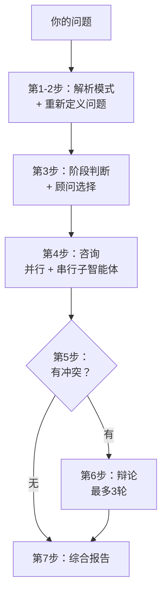

# Qadvisor — 你的 AI 顾问董事会

> 17 位传奇大师，一间董事会。他们不只回答——**他们会吵起来**。

[English](README.md) | **中文**

[](LICENSE)
[](CONTRIBUTING.md)
[](#安装)

抛出一个难题——*"竞争对手降价 50%，我要不要跟？"*——Qadvisor 会：

1. **重新定义**你的问题（你问的 vs. 真正需要解决的）
2. 从 17 位大师中**智能路由** 3–5 位最相关的顾问
3. 让他们作为独立子智能体**并行分析**，各自严格锁定在自己的思维框架内
4. **检测**结论之间的冲突
5. 强制最多 **3 轮辩论**，直到收敛——或标记为"不可调和分歧"
6. 输出一份带 ✅ / ⚠️ / ❌ 明确判断和行动建议的**综合报告**

## 为什么这不是"17 个人设 prompt"

大多数人格 prompt 合集给你的是 17 段独白。Qadvisor 是一套决策系统：

- **调度器，不是选择器。** 它先重构你的问题——"怎么提高转化率"往往真正的问题是"你的目标客户到底是谁"
- **依赖感知的执行顺序。** 德鲁克（值不值得做）先于 Karpathy（AI 能不能做）；无依赖的顾问并行执行
- **冲突检测 + 强制辩论。** 当芒格说 ❌ 而马斯克说 ✅，双方会收到对方的论点并必须回应——修正、反驳或综合。硬上限 3 轮
- **刹车机制。** 每位顾问都有一份明确的"该杀掉哪类决策"清单——芒格猎杀沉没成本陷阱，巴菲特拒绝稀释护城河的机会，孙子否决打不赢的仗
- **输出纪律。** 每份分析上限 600 字，且必须包含至少 3 个具体数字。拒绝咨询顾问式废话
- **经过 eval 验证。** 顾问用二元判据测试集调优（[evals/](evals/)）——芒格技能通过系统化优化，通过率从 72% 提升到 100%

## 安装

### 作为 Claude Code 插件（推荐）

在 Claude Code 中：

```
/plugin marketplace add wolfqing/QadvisorSkills
/plugin install qadvisor@qadvisor
```

### 手动安装

```bash
git clone https://github.com/wolfqing/QadvisorSkills.git
cp -r QadvisorSkills/skills/* ~/.claude/skills/
```

## 使用

```
/qadvisor 我该不该辞职全职做我的副业项目？
```

```
/qadvisor --deep 我们是 3 人团队做 AI 笔记应用，大厂刚免费上线了同样的功能，怎么办？
```

| 模式 | 命令 | 顾问 |
|------|------|------|
| 标准 | `/qadvisor [问题]` | 3–5 位，自动路由 |
| 深度 | `/qadvisor --deep [问题]` | 8–10 位，覆盖所有相关层 |
| 全员 | `/qadvisor --all [问题]` | 全部 17 位 |
| 单人 | `/qadvisor-munger [问题]` | 只咨询这一位 |

顾问**用你的语言回答**——中文提问得中文报告，英文提问得英文报告。

## 报告示例（节选）

```
📋 综合报告：要不要跟进竞对的 50% 降价？

⚡ 问题重新定义：
  你问的是"要不要跟着降价"
  核心问题实际是"你的护城河是价格，还是他们砍不掉的东西？"

📍 阶段判断：竞争期

👥 咨询顾问（4位）：buffett、helmer → sunzi（先诊断力量再定打法）、munger

| 顾问 | 维度 | 判断 | 核心观点 |
|------|------|------|---------|
| 巴菲特 | 护城河与聚焦 | ❌ | 跟价会把护城河之战变成双输的毛利之战 |
| Helmer | 7 Powers | ⚠️ | 你有转换成本，价格是对方唯一武器——耗死它 |
| 孙子 | 战略博弈 | ❌ | 避实击虚——永远不在对方选的地形上开战 |
| 芒格 | 多元思维 | ❌ | 逆向：跟价必亏 40% 毛利，而流失风险只有约 8% |

🤝 共识区：不跟价。加深转换成本，让对方烧钱。
⚔️ 分歧区：无——无需辩论。

➡️ 建议下一步：
  1. 量化真正因价格流失的客户（目标：2 周内搞清）
  2. 上线提高转换成本的集成功能（产品负责，30 天）
  3. 仅当季度流失率超过 15% 时重新评估
```

## 顾问团（5 层 × 17 人）

| 层 | 顾问 | 找他做什么 |
|----|------|-----------|
| **战略决策** | 德鲁克 | 客户到底在为什么付费 |
| | 芒格 | 多学科压力测试、偏误猎杀 |
| | 巴菲特 | 护城河、聚焦、学会说不 |
| **竞争分析** | Helmer | 7 Powers——诊断结构性优势 |
| | Christensen | 颠覆路径、用户任务（JTBD） |
| | 孙子 | 战与不战、以弱胜强 |
| **产品与体验** | 乔布斯 | 极致标准、该砍什么 |
| | 原研哉 | 本质、清晰、留白 |
| | Eyal | 上钩模型、习惯设计 |
| | Kahneman | 系统 1/2、偏误、选择架构 |
| | Karpathy | AI 能做什么不能做什么、AI 产品架构 |
| **增长与传播** | Andrew Chen | 冷启动、网络效应、飞轮 |
| | Seth Godin | 紫牛——值得被谈论吗 |
| | Donald Miller | StoryBrand——把话说清楚 |
| | George Lois | 击穿噪音的大创意 |
| **执行与创业** | 马斯克 | 第一性原理、时间线压缩 |
| | Paul Graham | 想法质量、PMF、做不能规模化的事 |

每位顾问都由同一条三段式脊柱构成：

1. **提问框架** — 这个头脑如何拷问一个问题
2. **决策领域** — 什么该找他，什么该路由给别人
3. **刹车机制** — 他存在就是为了杀掉哪类决策

## 工作原理



## Evals

人格 prompt 好写，写好很难。每位顾问都应对照测试集调优：5 个难题 × 5 条二元判据
（简洁性、框架的真实运用、量化推理、语气还原、挑战预设）。

芒格顾问已完成这个闭环——基线 72% → 优化后 100%（加入输出上限和量化要求）。
完整实验记录见 [evals/munger/](evals/munger/)。其余 16 位顾问的 eval
是开放任务——[欢迎贡献](CONTRIBUTING.md)。

## 添加你自己的顾问

这个董事会天生为扩展而设计。想要 Nate Silver 做数据决策？Edward Tufte 做信息设计？
你心目中的领域大师？

阅读 [CONTRIBUTING.md](CONTRIBUTING.md)，从[顾问模板](docs/ADVISOR_TEMPLATE.md)开始。
附带 eval 结果的 PR 会被优先合并。

## 免责声明

这些技能是对公开文献（书籍、文章、访谈、演讲）中思维框架的**教育性演绎**，与真实人物本人
或其遗产管理方无任何关联，未获其背书。输出为 AI 生成的分析，仅供头脑风暴与学习，
**不构成专业、法律、财务或投资建议**。详见 [DISCLAIMER.md](DISCLAIMER.md)。

## 许可证

[MIT](LICENSE)
